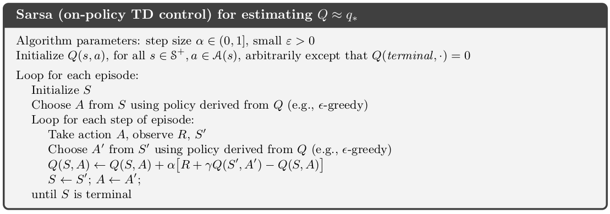
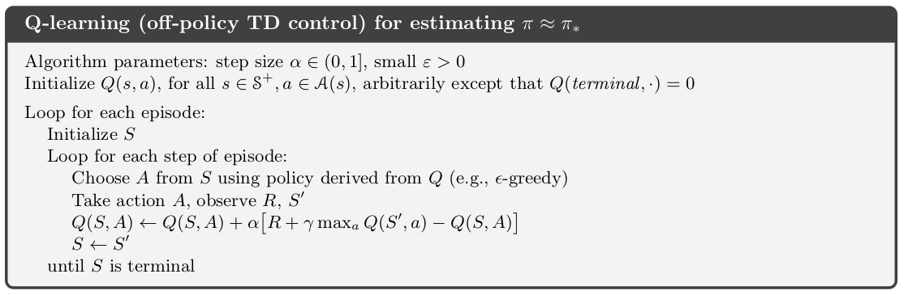
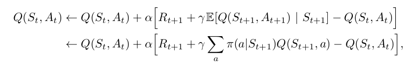
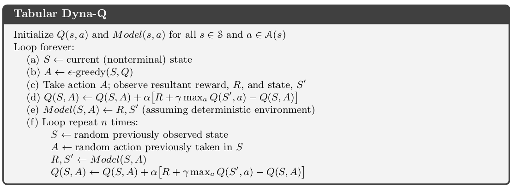
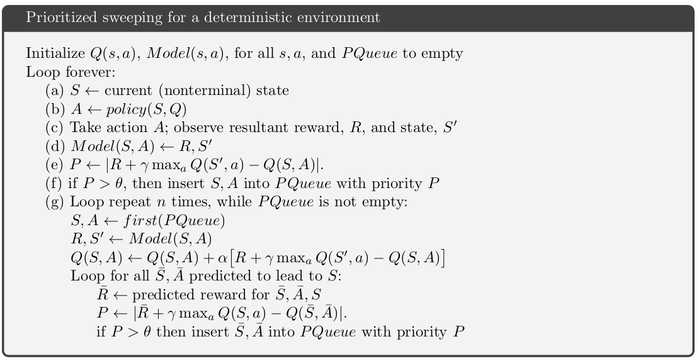

# RL Algorithm Implementations 

This project contains implementations of some basic reinforcement learning algorithms. 
I'm simply using a text based toy text environment to minimize resource requirements. The algorithms will also work on more complex text environments and learn the task given enough time and CPU. 

# Temporal-Difference Learning

Temporal-Difference (TD) learning is a combination of Monte Carlo ideas and dynamic programming (DP) ideas. It resides in the heart of Reinforcement Learning. 
In a single sentence, I would define TD as reevaluating your prediction after taking a step. You have a prediction for your destination. When you take a step, reestimate. Rinse and repeat. The motto is, "why wait to start learning until the goal is reached?". 

## SARSA: On Policy TD Control

Consider an episode consisting of states, actions and rewards. Like S_{t} , A_{t} , R_{t+1} , S_{t+1} , A_{t+1}, ... Sound familiar? Look again, it is SARSA

Implementation of the algorithms is straight forward. Check out my implementation [here](algorithms/SARSA_frozen.py)

## Q-learning: Off-policy TD Control

In Q-learning, independent of the followed policy, the learned action-value function, Q, directly approximates the optimal action-value function. Usually the q values are stored in a table called Q-table for easy access. 

Check my implementation [here](algorithms/Qlearn_frozen.py)

## Expected Sarsa

Instead of using the maximum of next action-state pairs, use *expected* value, then you have Expected SARSA. 

My implementation is [here](algorithms/expSARSA_frozen.py)

# Planning 

Model-based methods try to predict the future and rely on *planning*, unlike the model-free algorithms like TD. A common application area is maze problems. 

## Dyna Q

Dyna-Q algorithm integrates planning, acting and learning. The same reinforcement method is applied both for learning and planning. 

My [implementation](algorithms/dynaQ_frozen.py)

## Prioritized Sweeping

Instead of going towards the goal, prioritized sweeping algorithm focuses on going backward, from the goal. Instead of selecting uniformly random actions, we maintain a priority queue. 

My [implementation](algorithms/prioritized_sweep_frozen.py)

# References

The algorithm psuedo-codes and figures are from "the RL book" of Sutton and Barto.  

Sutton, Richard S., and Andrew G. Barto. *Reinforcement learning: An introduction*. MIT press, 2018.
